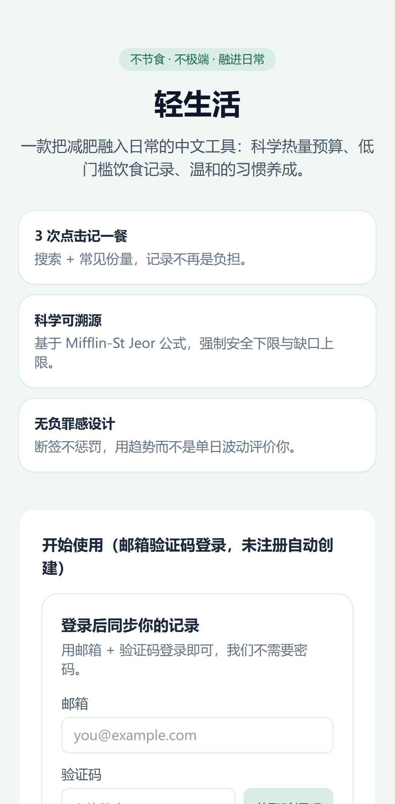
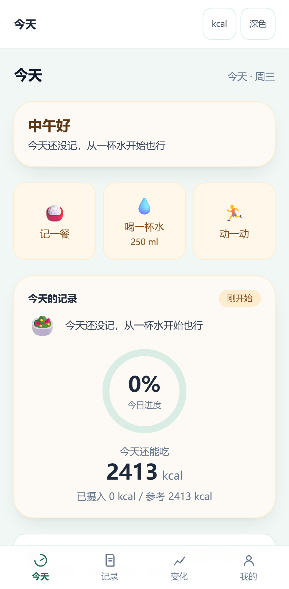
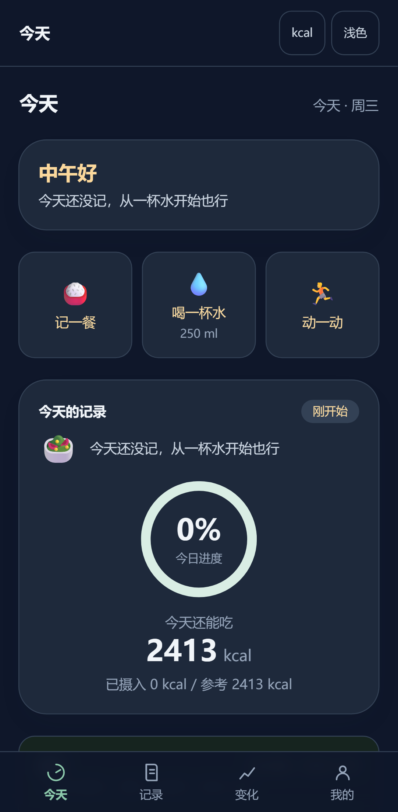
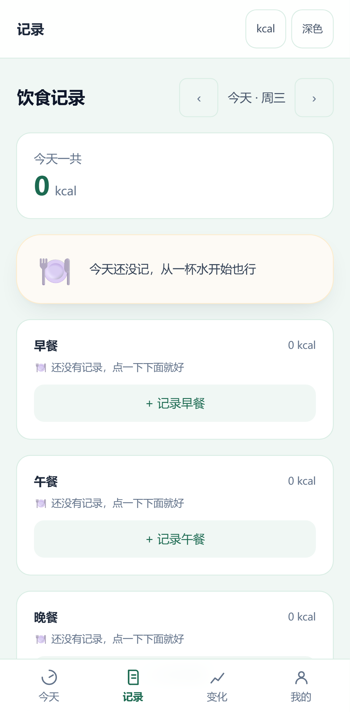
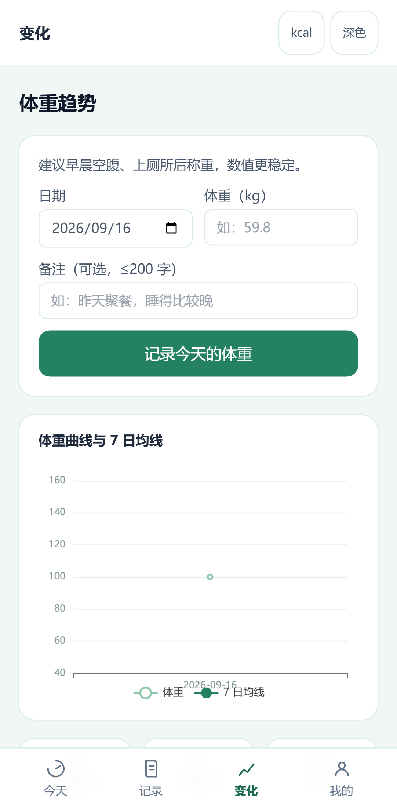

# 轻生活（qingshenghuo）

[](https://github.com/pythonh06719/-/actions/workflows/ci.yml)

> 移动端优先的生活化减肥工具 —— 不节食、不极端，把减肥融入日常生活。

本仓库为 **npm workspaces 单体仓库（monorepo）**，已交付**三期完整功能 + 容器化部署**：

| 交付 | 内容 |
| --- | --- |
| 热量引擎 | Mifflin-St Jeor 预算计算，强制安全下限（女 1200 / 男 1500）与缺口上限（TDEE × 30%），纯函数、可溯源 |
| 记录与反馈 | 饮食日记（3 次点击记一餐）、体重趋势、运动 MET 换算、饮水、习惯打卡 |
| 生活化工具 | 外卖换算、零食救赎（含运动等价换算）、聚餐模式、饮品计算、断食计时 |
| 在线食物库兜底 | 本地查不到时经服务端代理检索 Open Food Facts（条码识别 + 关键词），归一化为统一结构、过滤异常值，上游不可用则优雅降级 + 无负担提示；「加入并记录」入库复用既有流程 |
| 条码扫码 | 记录餐次时用手机摄像头识别包装条码（原生 `BarcodeDetector`，零额外依赖），镜头权限被拒 / 不支持时回退手输；画面仅在本地识别、不上传 |
| 报告与 AI | 周报 + 10 项微量营养素参考；AI 助手（医疗意图安全闸、单日 50 次限额、规则兜底降级，key 仅存服务端） |
| 数据主权 | CSV 导出 / 导入（含公式注入防护）、账号硬删除、隐私承诺（无广告 SDK、无第三方行为分析） |
| 可解释性 | `/why-numbers` 逐项解释每个数字的来源与算法，未登录也能打开查看纯解释（不触发登录跳转） |
| 部署 | `docker compose up -d --build` 一键起（nginx + NestJS + 可选 PostgreSQL），容器自动建表并幂等灌种子 |
| 测试 | core 85 / api 80 / web 84 = **249 用例全绿**，core 覆盖率 99.7% |

食物库 **443 条**（自建 57 + Open Food Facts 258 + USDA SR Legacy 128），逐条标注来源与许可，详见 [DATA-LICENSE.md](./DATA-LICENSE.md)。
运行时还可经服务端代理**在线兜底检索 Open Food Facts**（ODbL 1.0），查询与入库均不向浏览器泄露上游地址，聚合限流 20 次/分。

## 产品一览

6 个核心页面（Pixel 7 视口截图，`docs/screenshots/`）：

| 落地页 | 今天 · 浅色 |
| --- | --- |
|  |  |
| **今天 · 深色** | **饮食记录** |
|  |  |
| **AI 助手** | **体重变化** |
|  |  |

## 目录结构

```text
qingshenghuo/
├─ packages/
│  └─ core/        # ★ @qsh/core：零 IO、零运行时依赖的纯函数引擎（前后端唯一真源）
└─ apps/
   └─ web/         # Vite + React 18 + TypeScript + Tailwind 的最小可运行壳（落地页 + 免注册计算器）
```

- `@qsh/core`：热量预算引擎（BMR/TDEE/缺口/安全下限/宏量营养素）、单位换算、本地日期工具。
  该包 **`dependencies` 为空**，不执行任何 IO、`fetch` 或 `Date.now()`，时间一律由参数注入。
- `apps/web`：落地页（产品介绍 + 隐私承诺 + 免责声明）内嵌 **免注册试用计算器**，全程零网络写请求。

## 环境要求

- Node.js ≥ 20（本项目在 node v22.22.2 上验证通过）
- npm 10+

## 安装

```bash
npm install
```

> 若直连 npm 官方源较慢，可在仓库根目录的 `.npmrc` 中使用镜像源（已默认配置 `https://registry.npmmirror.com`）。

## 运行测试（热量引擎，含覆盖率门禁 ≥ 90%）

```bash
npm test
# 等价于 npm run test -w @qsh/core
```

覆盖率阈值（lines / functions / branches / statements 均 ≥ 90%）作为门禁，任一不足即失败。

### 本地跑前端 / 后端测试的正确姿势

> ⚠️ **已知现象**：`npm run test -w @qsh/web` 在本机会 **全部用例失败**，但 CI 是全绿的。
> **成因**：仓库内同时存在两份 vitest —— 根 `node_modules/vitest` 为 **2.1.9**（workspace 提升），
> 而 `apps/web/node_modules/vitest` 为 **2.0.5**（web 的 package.json 声明）。从工作区脚本启动时
> 会解析到偏低的那一份，与 `apps/web` 的测试配置 / jsdom 环境不匹配，于是报错而非断言失败。
> **彻底去重**需执行一次 `npm install`（网络良好时），让两份版本对齐；本仓库当前不为此变更依赖。

因此本地请**显式指定 vitest 入口**（绕过 workspace 脚本的版本解析）：

```bash
# 前端（apps/web，84 用例）
cd apps/web && node ../../node_modules/vitest/vitest.mjs run
# 等价写法（仓库根）
node node_modules/vitest/vitest.mjs run --root apps/web

# 后端（apps/api，端到端，会加载 dist 编译产物 → 先 build）
npm run build -w @qsh/api
cd apps/api && node ../../node_modules/vitest/vitest.mjs run
```

## 本地启动前端

```bash
npm run dev
# 打开终端提示的地址（默认 http://localhost:5173），在落地页完成一次免注册热量计算
```

## 环境变量（.env）

后端启动前，从 `.env.example` 复制一份到仓库根 `.env`（`.env` 已在 `.gitignore` 中）：

```bash
cp .env.example .env
```

| 变量 | 必填 | 说明 |
| --- | --- | --- |
| `JWT_SECRET` | ✅ | 会话签名密钥，填一段随机长字符串（`docker compose` 启动时会强制校验） |
| `DATABASE_URL` | — | 默认 `file:./dev.db`（SQLite），无需额外服务 |
| `AI_API_KEY` | — | 不填则 AI 对话不可用，其余功能正常 |
| `AUTH_LOG_CODE` | — | 默认 `false`。**开启后验证码会随 `/api/auth/send-code` 的响应体返回**，前端登录卡片自动预填（详见下） |

> ⚠️ **`AUTH_LOG_CODE=true` 的安全含义**：该开关等价于「**知道邮箱即可登录任意账号**」，
> 仅适用于**自用 / 本地演示**。对外提供的真实多用户服务**绝不可开启** ——
> 应接入真实 SMTP 并把本开关置回 `false`。
> 部署场景下的说明见 `docs/deploy-aliyun.md`、`docs/deploy-cloudflare-render.md` 的登录章节。

## 构建前端

```bash
npm run build
```

> 图表为**手写 SVG**（`apps/web/src/pages/weight/WeightChart.tsx`），无图表库依赖；
> 该 chunk 由体重页 `React.lazy` 按需加载，不影响首屏主包。

## 类型检查（全仓）

```bash
npm run typecheck
```

## 引擎契约要点

- **运算顺序严格遵循** `PRD §5.2` / `ARCHITECTURE §4.2`：先截断缺口上限（TDEE × 30%），后钳制安全下限（女 1200 / 男 1500），**下限优先级高于上限**，两个标志位可同时为 `true`。
- **中间链路保留浮点，仅输出取整**（`ARCHITECTURE §4.4`）。
- 校验三种返回形态：`validateCalorieInput`（返回错误数组）、`calcCalorieBudget`（抛 `CalorieInputError`）、`safeCalcCalorieBudget`（返回判别联合、不抛错）。

## 免责声明

本产品不提供医疗建议。孕期 / 哺乳期 / 疾病治疗期人群不建议使用热量缺口方案，请咨询专业医师。

## 许可

| 范围 | 许可 | 说明 |
| --- | --- | --- |
| 代码（本仓库全部源码） | [MIT](./LICENSE) | 自由使用、修改、商用 |
| 食物营养数据（`infra/db/seed/`） | **混合许可** | 自建 57 条 CC BY 4.0；Open Food Facts 258 条 **ODbL 1.0**（须署名 + 衍生库同许可）；USDA 128 条公有领域 |

详细义务（尤其是 ODbL 的署名与同许可要求）见 **[DATA-LICENSE.md](./DATA-LICENSE.md)**。

### 数据来源署名

- 包装食品营养数据：© [Open Food Facts](https://world.openfoodfacts.org) contributors（ODbL 1.0）
- 基础食材营养数据：[USDA FoodData Central — SR Legacy](https://fdc.nal.usda.gov)（公有领域），中文译名与归类由本项目完成
- 自建样例集与 MET / 习惯模板：本项目整理（CC BY 4.0）

