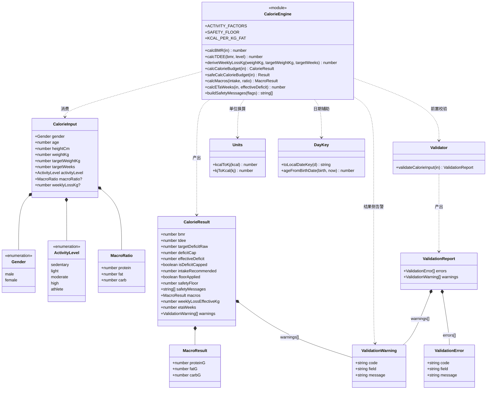
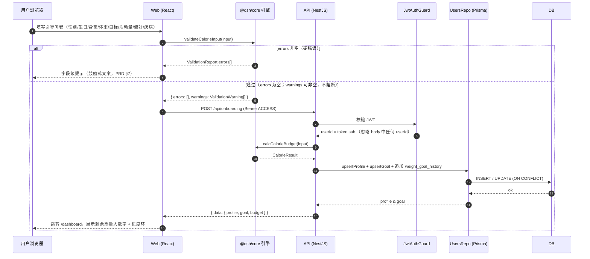
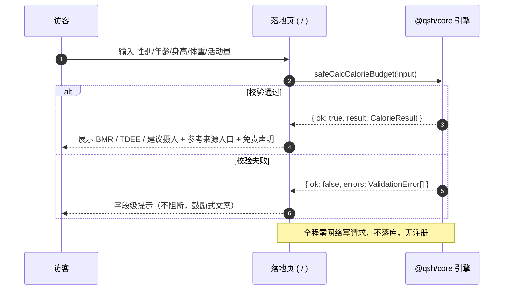
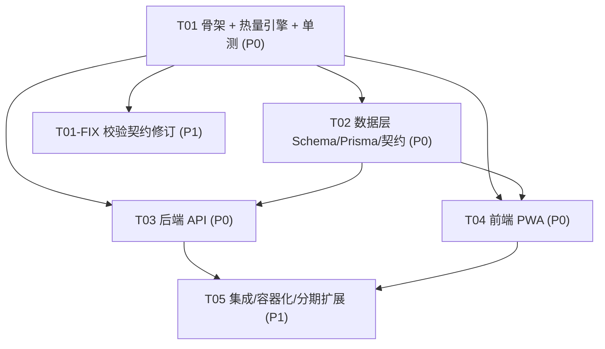

# 「轻生活」技术方案（ARCHITECTURE）

| 项目信息 | 内容 |
| --- | --- |
| 文档语言 | 简体中文 |
| 关联需求 | `docs/PRD.md` v1.0 |
| 文档职责 | 技术方案 + 目录结构 + 数据库设计 + 引擎接口 + 依赖清单 + 任务分解 |
| 权威输入 | PRD §5 热量引擎契约、§6 页面结构、§8 可测试用例、§9 数据格式契约 |
| 交付分期 | 本轮仅交付「设计」：①技术方案与目录结构 ②数据库 Schema；代码由工程师按 §6 任务列表执行 |
| 版本 | v1.0 |

> **本轮边界（CRITICAL）**：客户要求分阶段交付，本轮**只做设计不写业务代码**。
> 「热量计算引擎完整代码 + 单元测试」由工程师作为**第 1 组任务（T01）**立即执行，确认无误后再逐模块开发。
> 因此本文档的 §6 任务列表把「脚手架 + 热量引擎 + 单元测试跑通」排在最前，作为可运行的最小骨架。

---

## 1. 实现方案与框架选型

### 1.1 核心挑战

| # | 挑战 | 说明 | 应对 |
| --- | --- | --- | --- |
| C1 | **引擎前后端复用** | 落地页免注册计算器必须在前端跑（无网络也成立），服务端落库也必须算（唯一可信来源） | 抽出零依赖纯函数包 `@qsh/core`，前后端以 workspace 依赖共享**同一份代码** |
| C2 | **数字可溯源 & 安全下限优先** | 缺口上限（30%）与安全下限的顺序、取整链路必须与 PRD §5.2 逐字一致，且被 100% 单测覆盖 | 引擎为纯函数、显式运算顺序、边界用例 TC-04~TC-08 内置 |
| C3 | **账号删除 = 硬删除** | 导出/导入/删除要求数据真实移除，非软删 | 全表 `ON DELETE CASCADE` 外键 + 无软删字段 |
| C4 | **无第三方行为 SDK** | 隐私承诺要求不出售数据、无广告 SDK、无第三方分析 | 仅自托管第一方统计；CSP 白名单收紧 |
| C5 | **离线可看可记** | PWA 离线查看历史 + 离线队列写入 | Service Worker 缓存只读数据；写操作进 IndexedDB 队列，联网后同步 |

### 1.2 选型结论速览

| 层 | 选型 | MVP 是否落地 | 理由摘要 |
| --- | --- | --- | --- |
| 仓库 | **npm workspaces 单体仓库** | ✅ | 引擎复用是硬约束；npm 内置，机器无需额外安装（本机无 pnpm） |
| 语言 | TypeScript 5（strict） | ✅ | 前后端同语言，契约共享 |
| 前端 | React 18 + Vite 5 + Tailwind 3 + React Router 6 | ✅ | 移动端优先、构建快、PWA 友好 |
| 状态/数据 | Zustand + TanStack Query | ✅ | 轻量本地态 + 服务端缓存 |
| 图表 | ECharts 5 | ✅（体重趋势） | 移动端自适应、趋势/移动平均线现成 |
| 后端 | NestJS 10（Express） | ✅ | 模块化 DI，贴合成长型项目与鉴权分层 |
| ORM | Prisma 5 | ✅ | 迁移 + 类型安全；SQLite/PG 双 provider 可切换 |
| 数据库 | **SQLite（MVP 开发）→ PostgreSQL（生产）** | ✅ | 先跑通再上生产库，DDL 双版本已给 |
| 纯函数包 | `@qsh/core`（零 IO、零运行时依赖） | ✅ | 引擎复用 + 易测；前后端唯一真源 |
| 校验 | 引擎内手写校验（零依赖）+ Nest 侧 class-validator | ✅ | core 不能引入框架依赖 |
| 测试 | Vitest 2 + @testing-library | ✅ | 与 Vite 同源，配置零割裂 |
| PWA | vite-plugin-pwa | ✅ | Workbox 声明式离线策略 |
| 部署 | Docker Compose（web/api/db） | 二期 | MVP 本地 `npm run dev` 即可运行 |
| AI | 服务端环境变量可替换 LLM | 三期 | key 仅服务端；未配置则降级隐藏入口 |

### 1.3 决策论证 A：Next.js 全栈 vs Vite 前端 + NestJS 后端

| 维度 | Next.js 全栈 | **Vite + React + NestJS（采纳）** |
| --- | --- | --- |
| 引擎复用 | 可放 `lib/`，但 SSR/RSC 边界易把纯函数与 Node 运行时分不清 | 显式抽出 workspace 包，前端静态打包 + 后端 Node，**边界最清晰** |
| 离线 PWA | App Router + SW 组合有已知坑，离线写队列需额外方案 | Vite + Workbox 路线成熟，IndexedDB 队列实现直接 |
| 落地页性能 | SSR 首屏好 | 落地页为静态页 + 客户端计算，**首屏 < 2s 同样可达成**（PRD NFR-3） |
| 鉴权分层 | Route Handler 混在 UI 层，越权防护靠约定 | Nest Guard/Interceptor 强制「一律取 JWT userId」，**TC-42 更易守** |
| 长期可维护 | 单包，前后端边界随规模变模糊 | 前后端独立演进、独立部署/扩容 |
| 团队上手成本 | 低（一个框架） | 中（两个应用，但都是主流） |

**结论**：采纳 **Vite 前端 + NestJS 后端**。核心理由是 **C1（引擎复用）与 C2（鉴权越权防护）** 两个硬约束在双应用 + 共享包的形态下边界最清晰，且与 PRD 的 PWA 离线要求（Q7/TC-47）配合最佳。Next.js 的 SSR 收益在本产品（登录后应用页为主、落地页简单）不足以抵消边界模糊的代价。

### 1.4 决策论证 B：PostgreSQL vs SQLite（是否用 ORM 让两者可切换）

| 维度 | 仅 SQLite | 仅 PostgreSQL | **SQLite(MVP)→PG(生产) + Prisma（采纳）** |
| --- | --- | --- | --- |
| MVP 启动成本 | 最低 | 需装库/容器 | 最低（文件库，零运维） |
| 生产并发/JSONB | 弱 | 强 | 生产用 PG `jsonb` + 索引 |
| 迁移风险 | 后期换库要重写 DDL | — | **DDL 双版本 + Prisma 双 provider 已预置**，切换仅换 connection string + provider |
| 类型差异 | 无 BOOLEAN/DATE 原生 | 原生 | Prisma 归一化；裸 SQL 场景由 `SCHEMA.sql`/`schema.pg.sql` 分别覆盖 |
| 团队心智 | 低 | 中 | 中（可接受） |

**结论**：采纳 **Prisma（provider 可由环境切换）+ 双 DDL**。
- MVP 开发/单测用 **SQLite**（`docs/SCHEMA.sql` 可直接 `sqlite3` 执行）；
- 生产用 **PostgreSQL 16**（`docs/schema.pg.sql`）；
- **JSON 字段差异显式处理**：SQLite 用 `TEXT` 存 JSON 字符串，PG 用 `jsonb`；布尔 SQLite 用 `INTEGER 0/1`、PG 用 `BOOLEAN`；时间戳 SQLite 用 `TEXT`（ISO8601 UTC）、PG 用 `TIMESTAMPTZ`。
- 不追求「一份 DDL 双跑」，而是**两套清晰可执行 DDL**（胜过写满条件注释的单文件），Prisma schema 作为 ORM 单一真源。

### 1.5 决策论证 C：单体仓库 monorepo（workspaces）vs 单包

| 维度 | 单包（web 内嵌 api） | **npm workspaces monorepo（采纳）** |
| --- | --- | --- |
| C1 引擎复用 | 靠相对路径 import，跨端复用脆弱 | `@qsh/core` 被 web/api 同时依赖，**编译期保证同源** |
| 契约共享 | 类型易漂移 | `@qsh/shared-types` 统一 DTO/导出契约 |
| 依赖隔离 | 前端可能误引入 Node 包 | 各包独立 `package.json`，前端打包不会带 Node 依赖 |
| 工具链 | 简单 | 统一 `tsconfig.base.json` + 根脚本，复杂度可控 |
| CI | 简单 | 按包增量跑测试，**引擎单测作为门禁** |

**结论**：采纳 **npm workspaces 单体仓库**（`packages/*` + `apps/*`）。备选 pnpm workspace 团队熟练后可平滑替换（本机未安装 pnpm，故 MVP 用 npm 以保「开箱即跑」）。

### 1.6 共享代码策略（决定仓库结构的关键约束）

- **唯一真源**：热量/宏量/单位/日期/生活化工具的全部**计算逻辑**只存在于 `packages/core`，零 IO、零运行时依赖（详见 §4）。
- **前端消费**：落地页免注册计算器**直接在浏览器调用** `safeCalcCalorieBudget()`，不发请求、不落库（PRD US-01）。
- **后端消费**：`/onboarding`、`/profile` 修改基础数据时，服务端**再次调用同一函数**计算并落库（唯一可信来源，杜绝前端伪造数字）。
- **契约共享**：`packages/shared-types` 导出 `CalorieInput`/`CalorieResult`/DTO/导出 JSON 结构，前后端引用同一类型。
- **禁止**：任何一端复制粘贴公式；任何公式改动必须同时通过 `packages/core/test` 门禁。

### 1.7 鉴权与越权防护

| 项 | 约定 |
| --- | --- |
| 密码 | `bcryptjs`（纯 JS 实现 bcrypt 算法，避免原生编译），**cost = 12**，仅存 `password_hash`（PRD R1.6 / NFR-1） |
| 登录方式 | 一期：邮箱 + 验证码（`auth_verification_codes`，验证码存 **hash**、5 分钟过期、一次性消费）；同时保留密码登录（bcrypt） |
| JWT | 访问令牌 `ACCESS`（2h）+ 刷新令牌 `REFRESH`（30d，可撤销）；`sub = userId`；`iss/aud/exp` 必校验 |
| 令牌存取 | Access Token 内存（Zustand，不落 localStorage）；Refresh Token 存 **HttpOnly + Secure + SameSite=Lax Cookie**，前端不可读 |
| 越权防护 | **服务端一律从 JWT 取 `userId`**：`@CurrentUser()` 取自 `req.user.sub`，**忽略请求体/查询中的任何 `userId` 字段**；所有仓库查询强制 `where user_id = jwtUserId`，命中他人资源返回 404（不泄露存在性）（PRD NFR-2 / TC-42 / TC-43） |
| 未携带/伪造 | 401，不返回任何业务数据（TC-43） |
| 传输/头部 | HTTPS + `helmet` + 严格 CSP（无第三方行为分析域）+ `@nestjs/throttler` 限流（登录/验证码接口更严） |

### 1.8 AI key 与安全边界（三期，但一期即定约束）

- AI key **仅存在于服务端环境变量**（`AI_API_KEY`），前端产物与网络请求中绝不出现（PRD R9.5 / NFR-6 / TC-45）。
- AI **只返回食物名称与数量**，热量必须由食物库匹配；结果需用户确认才入库（PRD R3.7 / US-09 / TC-22/23）。
- 命中疾病诊断 / 停药 / 极端节食意图 → **固定回复就医建议**（PRD R9.6 / US-21 / TC-44）。
- 未配置 key：`/ai` 与 AI 识别入口显示「暂不可用」，其余功能不受影响（PRD R3.7 / TC-24）。
- 限额每账号每日 50 次，落 `ai_usage`（PRD R9.4 / TC-45）。

### 1.9 PWA 离线策略

| 数据 | 策略 | 说明 |
| --- | --- | --- |
| 应用壳（HTML/JS/CSS/字体） | **预缓存**（CacheFirst） | 保证断网可打开（TC-47） |
| 食物库（≥500 条，只读） | **StaleWhileRevalidate** + IndexedDB 兜底 | 离线仍可搜索记录（NFR-4） |
| 历史记录（体重/饮食/运动/习惯/饮水） | **NetworkFirst，失败回退缓存副本** | 离线**可查看**历史与当日（TC-47） |
| 写操作（记录一餐/体重/饮水…） | **离线队列（IndexedDB）** | 离线允许记录，恢复联网后按本地时间顺序自动同步；冲突以本地最新时间为准（PRD Q7） |
| 敏感接口（导出/删除/AI） | **不缓存** | 仅联网可用 |

### 1.10 MVP 最小落地清单（一期必做）

`packages/core`（引擎+测试）→ `packages/shared-types` → `docs/SCHEMA.sql`+Prisma → `apps/api`（auth/onboarding/foods/meals/combos/weights/dashboard）→ `apps/web`（`/`、`/onboarding`、`/dashboard`、`/diary`、`/weight`、`/profile`+`/settings/data`）。
其余路由（`/exercise`、`/habits`、`/tools`、`/fasting`、`/report`、`/ai`）以**占位路由 + 分期标注**存在，二三期填充。

---

## 2. 目录结构

> 相对仓库根 `qingshenghuo/`。`// Phase 2` / `// Phase 3` 标注为分期占位（一期可先建空文件/空目录）。

```text
qingshenghuo/
├─ package.json                      # 根：npm workspaces + 统一脚本（dev/build/test/lint）
├─ package-lock.json
├─ tsconfig.base.json                # 共享 TS 严格配置 + 路径别名 @/*
├─ .editorconfig
├─ .gitignore
├─ .env.example                      # DATABASE_URL / JWT_SECRET / AI_API_KEY 等（占位）
├─ .eslintrc.cjs · .prettierrc
├─ README.md
├─ docker-compose.yml                # web + api + postgres          // Phase 2
├─ docs/
│  ├─ PRD.md
│  ├─ ARCHITECTURE.md                # 本文档
│  ├─ SCHEMA.sql                     # SQLite DDL（MVP，可直接执行）
│  ├─ schema.pg.sql                  # PostgreSQL 16 DDL（生产）
│  ├─ class-diagram.mermaid          # 引擎类图（§4.1 导出）
│  └─ sequence-diagram.mermaid       # 引擎时序图（§4.3 导出）
├─ packages/
│  ├─ core/                          # ★ 零 IO、零运行时依赖纯函数包（前后端复用唯一真源）
│  │  ├─ package.json
│  │  ├─ tsconfig.json
│  │  ├─ vitest.config.ts            # 覆盖率阈值 ≥90%，门禁
│  │  └─ src/
│  │     ├─ index.ts                 # 统一导出面
│  │     ├─ calorie/
│  │     │  ├─ types.ts              # CalorieInput / CalorieResult / MacroRatio / 枚举
│  │     │  ├─ constants.ts          # ACTIVITY_FACTORS / SAFETY_FLOOR / KCAL_PER_KG_FAT=7700
│  │     │  ├─ formulas.ts           # calcBMR / calcTDEE / deriveWeeklyLossKg / calcCalorieBudget
│  │     │  ├─ validate.ts           # validateCalorieInput / CalorieInputError / 契约校验
│  │     │  ├─ macros.ts             # calcMacros（4/9/4）
│  │     │  └─ messages.ts           # buildSafetyMessages（鼓励式中文文案，PRD §7）
│  │     ├─ units/convert.ts         # kcal<->kJ(4.184)、g<->kg、ml<->l
│  │     ├─ date/daykey.ts           # toLocalDateKey(YYYY-MM-DD 本地时区) / ageFromBirthDate
│  │     ├─ exercise/met.ts          # kcal = MET × kg × h（纯函数）          // Phase 2
│  │     ├─ tools/                   # 外卖/零食/聚餐/饮品估算纯计算           // Phase 2
│  │     │  └─ estimates.ts
│  │     └─ export/serialize.ts      # §9 导出 JSON/CSV 序列化（纯函数）       // Phase 2
│  │  └─ test/
│  │     ├─ budget.test.ts           # 主链路 + 活动系数（TC-09/10/11/12）
│  │     ├─ boundaries.test.ts       # 边界（TC-04~TC-08）
│  │     ├─ acceptance.test.ts       # 验收用例（TC-01 / TC-02 / TC-06）
│  │     ├─ macros.test.ts           # 宏量换算与取整（TC-10/11）
│  │     ├─ validate.test.ts         # 输入契约与错误码（TC-11）
│  │     ├─ units-date.test.ts       # 单位换算 + 本地日期键
│  │     └─ fixtures/                # 用例输入快照（与 PRD §8 对齐）
│  │        └─ acceptance.json
│  └─ shared-types/                  # 前后端契约类型
│     ├─ package.json
│     └─ src/{index.ts, api.ts, entities.ts, export.ts}
├─ apps/
│  ├─ api/                           # NestJS 10 后端
│  │  ├─ package.json · tsconfig.json · nest-cli.json
│  │  ├─ prisma/
│  │  │  ├─ schema.prisma            # provider 由环境切换（sqlite / postgresql）
│  │  │  └─ schema.pg.prisma         # 生产库 provider 快照
│  │  └─ src/
│  │     ├─ main.ts                  # bootstrap + helmet + 全局 ValidationPipe + CORS
│  │     ├─ app.module.ts
│  │     ├─ common/
│  │     │  ├─ guards/jwt-auth.guard.ts        # 校验 JWT（TC-43）
│  │     │  ├─ decorators/current-user.ts      # 从 JWT 取 userId（TC-42）
│  │     │  ├─ interceptors/response.interceptor.ts  # 统一 { data, error }
│  │     │  └─ filters/all-exceptions.filter.ts      # 统一错误码
│  │     ├─ auth/                    # 邮箱+验证码、bcrypt、JWT（R1.1/R1.6/R1.7）
│  │     │  ├─ auth.module.ts · auth.service.ts · auth.controller.ts
│  │     │  ├─ dto/{send-code.dto.ts, verify-code.dto.ts, login.dto.ts}
│  │     │  └─ strategies/jwt.strategy.ts
│  │     ├─ users/                   # 引导问卷 + 基础数据修改重算（R1.3/R1.4）
│  │     │  ├─ users.module.ts · users.service.ts · users.controller.ts
│  │     │  └─ dto/{onboarding.dto.ts, update-profile.dto.ts}
│  │     ├─ foods/                   # 食物库：搜索/分类/收藏/最近（R3.1~R3.4）
│  │     │  ├─ foods.module.ts · foods.service.ts · foods.controller.ts
│  │     │  └─ import/food-seed.service.ts     # 载入 infra/db/seed
│  │     ├─ meals/                   # 饮食记录 + 套餐模板（R3.4/R3.5/R3.8/R3.9）
│  │     │  ├─ meals.module.ts · meals.service.ts · meals.controller.ts
│  │     │  ├─ combos.controller.ts
│  │     │  └─ dto/{create-meal.dto.ts, quick-add.dto.ts, combo.dto.ts}
│  │     ├─ weights/                 # 体重记录 + 7 日均线数据（R7.1/R7.2）
│  │     ├─ dashboard/               # 今日看板聚合（剩余热量/进度环）
│  │     ├─ exercise/                #                              // Phase 2
│  │     ├─ water/                   #                              // Phase 2
│  │     ├─ habits/                  #                              // Phase 2
│  │     ├─ fasting/                 #                              // Phase 2
│  │     ├─ report/                  # 周报 + 微量营养素                // Phase 2
│  │     ├─ data/                    # 导出/导入/硬删除（R10.1~R10.4）  // Phase 2
│  │     └─ ai/                      # AI 助手（R9.x，key 仅服务端）     // Phase 3
│  └─ web/                           # Vite + React 18 + Tailwind PWA
│     ├─ package.json · tsconfig.json · vite.config.ts · tailwind.config.ts
│     ├─ postcss.config.js · index.html
│     ├─ public/{manifest.webmanifest, icons/*}   # PWA
│     └─ src/
│        ├─ main.tsx · App.tsx                    # 入口 + 路由挂载
│        ├─ router/routes.tsx                     # 12 组路由（含分期占位）
│        ├─ lib/{api.ts, queryClient.ts, auth.store.ts}
│        ├─ pwa/{service-worker.ts, offline-queue.ts}   # SW + IndexedDB 队列
│        ├─ theme/{tokens.ts, dark.css, a11y.css}
│        ├─ components/                           # 复用组件
│        │  ├─ layout/{AppShell.tsx, BottomNav.tsx}
│        │  ├─ common/{ProgressRing.tsx, BigNumber.tsx, CalorieCalculator.tsx}
│        │  └─ feedback/{SafetyBanner.tsx, EncouragementText.tsx}
│        ├─ pages/
│        │  ├─ landing/            # `/` 落地页（免注册计算器，US-01/02）
│        │  ├─ onboarding/         # `/onboarding`（免责声明 + 问卷 + 结果，US-03/04/20）
│        │  ├─ dashboard/          # `/dashboard`（US-05 展示预算）
│        │  ├─ diary/              # `/diary`（3 次点击记一餐，US-06~08）
│        │  ├─ weight/             # `/weight`（7 日均线，US-14）
│        │  ├─ profile/            # `/profile`（修改重算 + 参考来源）
│        │  ├─ settings-data/      # `/settings/data`（导出/导入/删除，US-18/19）
│        │  ├─ exercise/ · habits/ · tools/ · fasting/ · report/ · ai/   # Phase 2/3 占位
│        └─ styles/index.css       # Tailwind 入口
│     └─ test/                     # @testing-library 组件测试
├─ infra/
│  ├─ db/seed/
│  │  ├─ food_items.seed.json      # ≥500 条中式食物库（数据源待客户提供，Q8）
│  │  ├─ met_activities.seed.json  # MET 表                                  // Phase 2
│  │  └─ habit_templates.seed.json # 内置习惯模板                            // Phase 2
│  └─ nginx/default.conf           # 静态托管 + 反向代理                      // Phase 3
└─ .github/workflows/ci.yml        # 引擎单测门禁 + lint + build              // Phase 2
```

---

## 3. 数据库 Schema

> **可执行 DDL**：`docs/SCHEMA.sql`（SQLite，MVP 默认）与 `docs/schema.pg.sql`（PostgreSQL 16，生产）。
> 本节说明设计意图；字段级定义以两个 SQL 文件为准。

### 3.1 表清单（20 张）

| # | 表 | 期 | 职责 | 关键约束 |
| --- | --- | --- | --- | --- |
| 1 | `users` | 一期 | 身份与鉴权 | `email` 唯一 |
| 2 | `auth_verification_codes` | 一期 | 邮箱验证码（存 hash、一次性） | `(email, purpose)` 索引 |
| 3 | `user_profiles` | 一期 | 性别/生日/身高/活动量/饮食偏好/**疾病(敏感)** | 1:1 `user_id` PK |
| 4 | `user_goals` | 一期 | **当前生效**目标（目标体重/期限/缺口/宏量比例） | `user_id` 唯一 |
| 5 | `weight_goal_history` | 一期 | 目标变更历史（追加式） | `(user_id, effective_from)` |
| 6 | `user_settings` | 一期 | 单位 kcal/kJ、深色模式、饮水目标、断食开关 | 1:1 `user_id` PK |
| 7 | `weight_logs` | 一期 | 每日体重 + 备注 | `(user_id, logged_at)` 索引；同日唯一 |
| 8 | `food_items` | 一期 | 食物库（每 100g 营养 + 份量单位） | `name`、`barcode`(唯一,部分) 索引 |
| 9 | `food_favorites` | 一期 | 收藏（R3.4） | 复合 PK |
| 10 | `meal_logs` | 一期 | 饮食记录（4 种来源） | `(user_id, logged_date)` 索引 |
| 11 | `meal_combos` | 一期 | 套餐模板头 | `(user_id, name)` |
| 12 | `meal_combo_items` | 一期 | 套餐模板明细 | `combo_id` CASCADE |
| 13 | `exercise_logs` | 二期 | 运动消耗 | `(user_id, logged_date)` |
| 14 | `met_activities` | 二期 | MET 表（R6.1） | `code` PK |
| 15 | `water_logs` | 二期 | 饮水记录（可撤销上一条） | `(user_id, logged_date, logged_at)` |
| 16 | `habit_definitions` | 二期 | 习惯项（内置 + 自定义） | `(user_id, code)` 唯一 |
| 17 | `habit_checkins` | 二期 | 习惯打卡 | `(user_id, habit_id, logged_date)` 唯一 |
| 18 | `fasting_settings` | 二期 | 断食设置（默认关闭） | 1:1 `user_id` PK |
| 19 | `fasting_sessions` | 二期 | 断食会话 | `(user_id, started_at)` |
| 20 | `ai_usage` | 三期 | AI 每日限额计数（R9.4） | `(user_id, usage_date, feature)` 唯一 |

**补充表理由（超出 PRD 显式列表者）**

| 表 | 理由 |
| --- | --- |
| `auth_verification_codes` | R1.1 邮箱验证码登录必须持久化一次性验证码，且需 `expires_at`/消费标记 |
| `user_profiles` / `user_goals` / `user_settings` | 把 `users` 收敛为纯鉴权表，避免敏感（疾病）字段与登录字段耦合；亦对齐 §9.1 导出「profile / goals / settings」三段结构 |
| `weight_goal_history` | R1.4「修改即自动重算」需保留目标变更轨迹，支撑预测曲线与审计；避免覆盖丢历史 |
| `meal_combo_items` | R3.9 套餐是「多条目组合」，需明细表；模板修改不影响历史记录（US-10） |
| `met_activities` | R6.1 要求可维护的 MET 表，独立成表利于热更与来源标注 |
| `habit_definitions` | R7.3 习惯可自定义，需用户级定义表（内置项 `user_id IS NULL`） |
| `food_favorites` | R3.4 收藏为独立多对多关系，避免污染食物库 |

### 3.2 跨库字段约定（SQLite ↔ PostgreSQL）

| 语义 | SQLite | PostgreSQL | 应用约定 |
| --- | --- | --- | --- |
| 主键 | `INTEGER PRIMARY KEY AUTOINCREMENT` | `BIGINT GENERATED BY DEFAULT AS IDENTITY` | 对外不暴露连续性含义 |
| 布尔 | `INTEGER`（0/1，CHECK） | `BOOLEAN` | 应用层归一 |
| JSON | `TEXT`（JSON 字符串） | `JSONB` | 应用层 `JSON.parse/stringify` |
| 日期 | `TEXT 'YYYY-MM-DD'`（**本地时区**） | `DATE` | 见「待明确」D1：日粒度用本地日期 |
| 时间戳 | `TEXT`（ISO8601 **UTC**，含毫秒） | `TIMESTAMPTZ` | 全部 UTC 存储，展示转本地 |
| 枚举 | `TEXT` + `CHECK(...)` | 同（不用原生 enum，便于演进） | 与 TS 联合类型对齐 |
| 金额/热量 | `REAL` / `REAL` | `NUMERIC` / `REAL`（沿用 `DOUBLE PRECISION`） | 见取整策略 §4.4 |

### 3.3 `food_items.serving_units` JSON Schema

自然份量输入（R3.3：个/碗/杯/片/袋），每单位可自定义克数。**存储为 JSON 字符串（SQLite）/ jsonb（PG）**。

```jsonc
// JSON Schema（Draft 2020-12 精简）
{
  "type": "array",
  "minItems": 1,
  "items": {
    "type": "object",
    "required": ["unit", "grams"],
    "additionalProperties": false,
    "properties": {
      "unit":      { "type": "string", "minLength": 1, "maxLength": 10, "description": "个/碗/杯/片/袋/份/支…" },
      "grams":     { "type": "number", "exclusiveMinimum": 0, "description": "该单位对应的克数" },
      "isDefault": { "type": "boolean", "default": false, "description": "默认选中单位（每项至多 1 个 true）" },
      "label":     { "type": "string", "maxLength": 20, "description": "展示别名，如『一中碗』(可选)" }
    }
  }
}
```

```json
// 示例：番茄炒蛋
[
  { "unit": "个", "grams": 60 },
  { "unit": "碗", "grams": 300, "isDefault": true, "label": "一中碗" },
  { "unit": "片", "grams": 20 }
]
```

换算规则（引擎/服务端统一）：`kcal = kcal_per_100g × (选定克数 ÷ 100)`；选定克数 = `单位默认克数` 或用户**自定义克数**（R3.3 / TC-17）。`default_serving_grams` 冗余一份便于排序与快捷默认。

### 3.4 索引与约束清单

| 表 | 索引 / 约束 | 目的 |
| --- | --- | --- |
| `users` | `UNIQUE(email)` | 登录唯一 |
| `meal_logs` | `INDEX(user_id, logged_date)`、`INDEX(user_id, logged_date, meal_type)` | 按日/按餐聚合（PRD 要求） |
| `weight_logs` | `INDEX(user_id, logged_at)`、`UNIQUE(user_id, logged_at)` | 趋势线 + 同日唯一（CSV 导入覆盖） |
| `food_items` | `INDEX(name)`、`INDEX(name_pinyin)`、`INDEX(category)`、`UNIQUE(barcode) WHERE barcode IS NOT NULL` | 模糊搜索 / 分类 / 扫码（TC-03/16/20） |
| `water_logs` | `INDEX(user_id, logged_date, logged_at)` | 当日汇总 + 撤销上一条（TC-33） |
| `habit_checkins` | `UNIQUE(user_id, habit_id, logged_date)` | 幂等打卡（TC-35） |
| `ai_usage` | `UNIQUE(user_id, usage_date, feature)` | 每日限额原子自增（TC-45） |
| 全部业务表 | `FOREIGN KEY ... ON DELETE CASCADE` | **账号硬删除级联**（R10.4 / TC-41） |
| 全部业务表 | `created_at` / `updated_at` | 审计与同步（应用层写 `updated_at`） |

### 3.5 与 PRD §9 数据主权映射

| §9 导出字段 | 来源表 | 说明 |
| --- | --- | --- |
| `meta.schemaVersion` | 常量 | 升级时递增，用于兼容解码 |
| `profile` | `user_profiles`（+`users.email`） | `conditions` 按 Q12 **默认可加密**，可选择性排除 |
| `goals` | `user_goals` | `macroRatio` 映射 `macro_ratio` JSON |
| `weights[]` | `weight_logs` | `date ← logged_at`，`weightKg`，`note` |
| `meals[]` | `meal_logs`（按日+餐分组） | `items[]` 反向展开；`grams/kcal/proteinG/...` |
| `exercises[]` | `exercise_logs` | `type ← activity_code`、`met`、`minutes`、`kcalBurned ← kcal_burned` |
| `habits[]` | `habit_checkins`（join `habit_definitions`） | `habitId ← code` |
| `water[]` | `water_logs`（按日聚合 `SUM(amount_ml)`） | `ml` 为当日合计 |
| `settings` | `user_settings` | `unit/darkMode/fastingEnabled` |
| CSV 文件（§9.2） | `weights/meals/exercises/habits/water` | UTF-8 with BOM，日期 `YYYY-MM-DD` |
| CSV 导入（§9.3） | → `weight_logs` | 同 `logged_at` **UPSERT 覆盖**；非法行跳过并汇总报错 |

---

## 4. 热量引擎模块 `@qsh/core` 设计

### 4.1 类图（`docs/class-diagram.mermaid`）



### 4.2 运算顺序（严格遵循 PRD §5.2，**不得调换**）

```text
1) bmrFloat   = (gender === 'male') ? 10·w + 6.25·h − 5·age + 5
                                    : 10·w + 6.25·h − 5·age − 161
2) tdeeFloat  = bmrFloat × activityFactor
3) weeklyLoss = input.weeklyLossKg ?? (weightKg − targetWeightKg) ÷ targetWeeks   // Q5
4) rawDeficit = weeklyLoss × 7700 ÷ 7
5) cap        = tdeeFloat × 0.30
6) effectiveDeficit = MIN(rawDeficit, cap)          // 先截断
7) rawIntake        = tdeeFloat − effectiveDeficit
8) floor            = gender === 'male' ? 1500 : 1200
9) intakeFinal      = MAX(rawIntake, floor)         // 后钳下限（优先级更高）
10) flags: isDeficitCapped = rawDeficit > cap        // 两者可同时为 true
          floorApplied    = rawIntake  < floor
11) macros = { proteinG: intakeFinal×p%÷4, fatG: intakeFinal×f%÷9, carbG: intakeFinal×c%÷4 }
12) weeklyLossEffective = (tdeeFloat − intakeFinal) × 7 ÷ 7700
13) etaWeeks = effectiveDeficit > 0
               ? (weightKg − targetWeightKg) ÷ (weeklyLossEffective)
               : null
```

### 4.3 时序图（`docs/sequence-diagram.mermaid`）

**① 首次引导 → 计算预算 → 写入 users → 看板展示（US-03 / US-05 / TC-12）**



**② 落地页免注册试用计算器（US-01，**不落库、不发写请求**）**



### 4.4 输出取整策略（Q3 / Q4）

> **中间链路保留浮点，仅输出取整**（PRD Q3）。以下为字段级取整规则：

| 输出字段 | 类型 | 取整 | 示例（TC-01） |
| --- | --- | --- | --- |
| `bmr` | 整数 | `Math.round` | 1320 |
| `tdee` | 整数 | `Math.round` | 1584 |
| `targetDeficitRaw` | 1 位小数 | `round1` | 550.0 |
| `deficitCap` | 1 位小数 | `round1` | 475.3 |
| `effectiveDeficit` | 1 位小数 | `round1` | 475.3 |
| `intakeRecommended` | 整数 | `Math.round` | 1200 |
| `safetyFloor` | 整数 | 常量 | 1200 |
| `macros.*G` | 1 位小数 | `round1`（比较容差 ±0.5g） | `{75.0, 33.3, 150.0}` |
| `weeklyLossEffectiveKg` | 2 位小数 | `round2` | 0.70 |
| `etaWeeks` | 2 位小数 / null | `round2` | 14.29 |

> ⚠️ **TC-02 数值差异（D2 记录保留）**：PRD 原稿给定 `cap = 474.9`，而按 `TDEE(1584.3) × 0.30 = 475.29`（未取整链路）应得 **475.3**。本设计以**公式为准（475.3）**，且因 `intake = max(1109.0, 1200) = 1200` 被下限钳制，**用户可见结果与 PRD 一致**。**PM 已同步修订 PRD §8.1 TC-02 的 `cap` 为 475.3**；结论：以公式为准，勿再按 474.9 断言。

**TC-02 显式输入示例（本次修订后）**：显式 `weeklyLossKg = 2`（女 30 / 165cm / 60kg / 久坐）

| 字段 | 值 | 说明 |
| --- | --- | --- |
| `targetDeficitRaw` | **2200.0** | `2 × 7700 ÷ 7` |
| `deficitCap` | **475.3** | `round1(1584.3 × 0.30)` |
| `isDeficitCapped` | **true** | `2200.0 > 475.29` |
| `effectiveDeficit` | **475.3** | `min(2200.0, 475.29)` → round1 |
| `intakeRecommended` | **1200** | `max(1108.99…, 1200)` |
| `floorApplied` | **true** | `1108.99 < 1200` |
| `warnings` | **2 条** | `W_WEEKLY_LOSS_AGGRESSIVE`（温和节奏）+ `W_FLOOR_APPLIED`（接近安全下限） |
| `safetyMessages` | **2 条** | 由 `isDeficitCapped`/`floorApplied` 渲染（保持现状） |

> 关键变化：显式 `weeklyLossKg = 2` **不再抛 `CalorieInputError`**，而是「**接受输入 → 30% 上限截断 → 温和告警**」，与 PRD §8.1 验收用例 2 逐字一致（详见 §4.5 与 D13）。

### 4.5 输入校验契约（校验输出分两级 —— 已定）

> **本次修订（对应 QA Q-01 / 主理人裁定方案 A）**：把原先自相矛盾的「`weeklyLossKg > weightKg × 2%` → 硬错误 `E_WEEKLY_LOSS`」**降级为非阻断告警**。
> 校验输出拆为**两级**：**硬错误 `errors`**（阻断，`calcCalorieBudget` 抛 `CalorieInputError`）与**告警 `warnings`**（**不阻断**，照常计算）。
> `min(rawDeficit, cap)`（TDEE 30% 上限）是缺口的**唯一防线** —— 显式链路与推导链路行为从此一致（见 D13）。

**① 硬错误 `errors: ValidationError[]`（阻断）—— 仅「不可计算」的输入**

| 字段 | 规则 | 错误码 |
| --- | --- | --- |
| `gender` | ∈ `{male, female}` | `E_GENDER` |
| `age` | 14 ≤ age ≤ 100 的整数 | `E_AGE` |
| `heightCm` | 80 ≤ h ≤ 250 | `E_HEIGHT` |
| `weightKg` | 20 ≤ w ≤ 400 | `E_WEIGHT` |
| `targetWeightKg` | > 0 且 ≤ `weightKg` | `E_TARGET_WEIGHT` |
| `targetWeeks` | 整数 > 0 且 ≤ 260 | `E_TARGET_WEEKS` |
| `activityLevel` | ∈ 5 档枚举 | `E_ACTIVITY` |
| `macroRatio` | 三者均 ≥0 且之和 = 100（容差 0） | `E_MACRO_SUM` |
| `weeklyLossKg`（若给） | **必须为有限值且 > 0**（`NaN`/`Infinity`/`<0`/`=0` → 硬错误，因无法计算缺口） | `E_WEEKLY_LOSS` |

**② 告警 `warnings: ValidationWarning[]`（不阻断）—— 「可计算但不理想」的输入/结果**

```ts
type ValidationWarning = {
  code: string;                    // 前缀 W_，与 §7 K3 规范一致
  field?: keyof CalorieInput;      // 输入侧告警指向字段；结果侧告警可省略
  message: string;                 // 鼓励式、无负罪感（§7 K4）
};
```

| 阶段 | 触发条件 | 告警码 | 文案方向（K4） |
| --- | --- | --- | --- |
| 输入侧（`validateCalorieInput` 产出） | `weeklyLossKg > weightKg × 0.02` | `W_WEEKLY_LOSS_AGGRESSIVE` | 「每周减重建议更温和一些（不超过当前体重的 2%）」 |
| 输入侧（`validateCalorieInput` 产出） | 目标体重对应 `BMI < 18.5` | `W_TARGET_BMI_LOW` | 「目标体重偏轻，建议和营养师聊聊更稳妥的区间」 |
| 结果侧（`calcCalorieBudget` 计算后产出） | `floorApplied === true` | `W_FLOOR_APPLIED` | 「这已接近安全下限，建议把目标调得更温和一些」 |

> **「缺口被 30% 上限截断」不另设告警码**：截断是 PRD 设计的**温和纠偏行为**（并非"不理想输入"），已由布尔字段 `isDeficitCapped` + `safetyMessages` 中的鼓励式文案「为了更可持续，已帮你把目标调整为更温和的节奏」承载，避免与 `safetyMessages` 重复。若另设 `W_DEFICIT_CAPPED` 会使 TC-02 告警数变为 3 条，与验收不符。
> **告警只是旁路输出，不参与也不影响 §4.2 的 1→13 步运算顺序（一个字都不改）。**

**返回形态（决定性约定 · 本次修订后）**：

```ts
type ValidationReport = {
  errors: ValidationError[];       // 硬错误（阻断）
  warnings: ValidationWarning[];   // 告警（不阻断）
};

type CalorieResult = {
  /* …原字段全部保留（§4.1 类图）… */
  warnings: ValidationWarning[];   // 【新增】输入侧 + 结果侧告警，按发生顺序拼接
};
```

| 函数 | 返回签名 | 失败 / 告警行为 |
| --- | --- | --- |
| `validateCalorieInput(input)` | `ValidationReport` | 纯校验；`errors` 为空即通过；`warnings` **永不阻断** |
| `calcCalorieBudget(input)` | `CalorieResult`（新增 `warnings` 字段） | **仅**当 `errors` 非空时 `throw CalorieInputError({ errors })`；否则照常计算，`warnings`（输入侧 + 结果侧）随结果返回 |
| `safeCalcCalorieBudget(input)` | `{ ok:true; result: CalorieResult } \| { ok:false; errors: ValidationError[] }` | 不抛错；判别联合**形态不变**，告警位于 `result.warnings` 内 |

**告警放置位置 = 选项 i（`CalorieResult.warnings`），选择理由与向后兼容**：

- **选选项 i 的理由**：`calcCalorieBudget` 与 `safeCalcCalorieBudget` **都产出/包裹同一个 `CalorieResult`**，把告警放进结果对象，两条链路**天然同时获得告警**，无需改动 `safeCalcCalorieBudget` 的联合类型（故**选项 iii 无必要**）；同时**保留 `safetyMessages` 不变**，现有断言不受影响（而**选项 ii** 的统一 `messages[]` 会破坏既有契约并混淆「结果侧安全文案」与「输入侧结构化告警」两个语义层）。
- **破坏性评估（务必遵守）**：
  - 对**读取方**为**非破坏性（新增字段型演进）**：`safeCalcCalorieBudget` 联合形态不变、`safetyMessages` 语义不变，仅 `CalorieResult` 多出 `warnings`；
  - **两处必须同步改写**：① `validateCalorieInput` 返回类型由 `ValidationError[]` 改为 `ValidationReport`（**签名变更**，唯一调用方为引擎内部与单测）；② 现有断言「显式 `weeklyLossKg=2` 抛错」的用例（`acceptance.test.ts`）与新契约冲突，**必须改写**为「不抛错且产出告警」。
- **结构化告警 vs 渲染文案**：`warnings` 是**结构化通道**（含 `code`，供 API/UI 决策、埋点与去重），`safetyMessages` 是**直接渲染文案**；同一条件（如触下限）两者可并存，UI 若同时展示应按 `code` **去重取一**。

**TC-02 逐字段预期（显式 `weeklyLossKg = 2`，女 30/165/60 久坐）**

| 通道 | 内容 | 条数 |
| --- | --- | --- |
| `errors` | 空（**校验通过，不抛错**） | 0 |
| `warnings` | `W_WEEKLY_LOSS_AGGRESSIVE`（温和节奏）、`W_FLOOR_APPLIED`（接近安全下限） | **2** |
| `safetyMessages` | capped 文案 + floor 文案（保持现状） | 2 |

> 前端一律用 `safeCalcCalorieBudget`（UI 好处理，读 `result.warnings` 渲染提示）；后端与单测可用抛错式以尽早暴露契约破坏。告警文案同样受 §7 K4 约束。

---

## 5. 依赖包清单

### 5.1 根 / 工具链（devDependencies）

| 包 | 版本 | 用途 |
| --- | --- | --- |
| `typescript` | `^5.5.4` | 全仓 TS |
| `eslint` / `@typescript-eslint/*` | `^8.x` / `^8.x` | 静态检查 |
| `prettier` | `^3.3.3` | 格式化 |
| `husky` / `lint-staged` | `^9.x` / `^15.x` | 提交门禁 |
| `concurrently` | `^8.2.2` | 并行 dev |
| `npm-run-all` | `^4.1.5` | 根脚本编排 |

### 5.2 `packages/core`（运行时零依赖；tester 见 dev）

| 包 | 版本 | 类型 | 用途 |
| --- | --- | --- | --- |
| `vitest` | `^2.0.5` | dev | 单测（与 Vite 同源） |
| `@vitest/coverage-v8` | `^2.0.5` | dev | 覆盖率（≥90% 门禁，NFR-5） |
| `tsx` | `^4.16.2` | dev | 本地快速执行 |

> `packages/core` **无 dependencies**：纯函数 + 零 IO，保证前端打包体积与可移植性（日期用原生 `Date` 手写 `toLocalDateKey`，不引 dayjs）。

### 5.3 `apps/api`

| 包 | 版本 | 类型 | 用途 |
| --- | --- | --- | --- |
| `@nestjs/common` `@nestjs/core` `@nestjs/platform-express` | `^10.4.1` | deps | Nest 运行时 |
| `@nestjs/jwt` `@nestjs/passport` `passport` `passport-jwt` | `^10.x` / `^10.x` / `^0.7.0` / `^4.0.1` | deps | JWT 鉴权（R1.7） |
| `bcryptjs` | `^2.4.3` | deps | bcrypt 密码哈希（cost 12；纯 JS，免原生编译） |
| `class-validator` `class-transformer` | `^0.14.1` / `^0.5.1` | deps | DTO 校验 |
| `@prisma/client` | `^5.19.1` | deps | ORM 运行时 |
| `prisma` | `^5.19.1` | dev | 迁移/生成 |
| `helmet` | `^7.1.0` | deps | 安全头 + CSP（C4） |
| `@nestjs/throttler` | `^6.2.1` | deps | 限流 |
| `cookie-parser` | `^1.4.6` | deps | Refresh Cookie |
| `nodemailer` | `^6.9.14` | deps | 验证码邮件（开发环境打印到日志，Q2） |
| `@qsh/core` `@qsh/shared-types` | `workspace:*` | deps | 共享引擎/契约 |
| `@nestjs/testing` `vitest` `supertest` | `^10.x` / `^2.0.5` / `^7.0.0` | dev | 接口测试 |

### 5.4 `apps/web`

| 包 | 版本 | 类型 | 用途 |
| --- | --- | --- | --- |
| `react` `react-dom` | `^18.3.1` | deps | UI |
| `react-router-dom` | `^6.26.1` | deps | 12 组路由 |
| `zustand` | `^4.5.5` | deps | 本地态（含内存态 token） |
| `@tanstack/react-query` | `^5.51.23` | deps | 服务端缓存/离线回退 |
| `echarts` `echarts-for-react` | `^5.5.1` / `^3.0.2` | deps | 趋势图/移动平均 |
| `vite` `@vitejs/plugin-react` | `^5.4.2` / `^4.3.1` | dev | 构建 |
| `tailwindcss` `postcss` `autoprefixer` | `^3.4.10` / `^8.4.41` / `^10.4.20` | dev | 样式 |
| `vite-plugin-pwa` | `^0.20.5` | dev | PWA/SW（NFR-4） |
| `@testing-library/react` `@testing-library/jest-dom` `jsdom` | `^16.0.0` / `^6.5.0` / `^24.1.1` | dev | 组件测试 |
| `@qsh/core` `@qsh/shared-types` | `workspace:*` | deps | 落地页就地计算（US-01） |

---

## 6. 任务列表（有序 · 按依赖）

> 硬约束：**≤ 5 个任务**；每任务 ≥ 3 个相关文件；**T01 必须是可运行最小骨架**。
> `Phase` 标注所属分期；`Priority` 为 P0/P1/P2。**T01 为工程师本轮立即执行的部分。**

| Task ID | 任务名 | 阶段 | 优先级 | 依赖 | 产出文件（相对路径） | 完成判据（DoD） |
| --- | --- | --- | --- | --- | --- | --- |
| **T01** | **可运行最小骨架 + 热量引擎 + 单元测试**（脚手架+引擎+测试跑通） | 一期 | P0 | — | `package.json`、`tsconfig.base.json`、`.gitignore`、`packages/core/package.json`、`packages/core/tsconfig.json`、`packages/core/vitest.config.ts`、`packages/core/src/index.ts`、`packages/core/src/calorie/{types,constants,formulas,validate,macros,messages}.ts`、`packages/core/src/units/convert.ts`、`packages/core/src/date/daykey.ts`、`packages/core/test/{budget,boundaries,acceptance,macros,validate,units-date}.test.ts`、`packages/core/test/fixtures/acceptance.json`、`apps/web/`（Vite+React+TS+Tailwind 最小壳 + `CalorieCalculator.tsx` 试用计算器）、`apps/web/src/pages/landing/*` | ① `npm install` 成功 ② `npm test` **全绿**（TC-01/02/04~12 通过，覆盖率 ≥90%）③ `npm run dev` 打开落地页可本地完成一次免注册计算 ④ 引擎零运行时依赖（无 `dependencies`） |
| **T02** | **数据层：Schema + Prisma + 共享契约 + 种子** | 一期 | P0 | T01 | `docs/SCHEMA.sql`（已交付）、`docs/schema.pg.sql`（已交付）、`apps/api/prisma/schema.prisma`、`apps/api/prisma/schema.pg.prisma`、`packages/shared-types/src/{index,api,entities,export}.ts`、`infra/db/seed/food_items.seed.json` | ① SQLite 上 `SCHEMA.sql` 可执行且 20 张表创建成功 ② `prisma migrate dev`/`db push` 通过 ③ `shared-types` 编译并导出 `CalorieInput/CalorieResult` ③ 种子 ≥500 条（数据待客户提供，Q8；先用合规样例集） |
| **T03** | **后端 API（NestJS）**：鉴权 + 引导/重算 + 食物库 + 饮食记录 + 套餐 + 体重 + 看板 | 一期 | P0 | T01、T02 | `apps/api/src/main.ts`、`app.module.ts`、`common/**`（guard/decorator/interceptor/filter）、`auth/**`、`users/**`、`foods/**`、`meals/**`、`weights/**`、`dashboard/**`（含各 `dto/`） | ① 邮箱验证码登录 + bcrypt 签发 JWT ② `/onboarding` 与 `/profile` 修改后**服务端重算并落库**（TC-12）③ **越权：忽略 body userId、一律取 JWT，命中他人资源 404**（TC-42/43）④ 响应统一 `{ data, error }` ⑤ 记录接口 P95 < 300ms（NFR-3） |
| **T04** | **前端应用（Vite React PWA）**：落地页 + 引导 + 看板 + 饮食日记 + 体重 + 我的/数据管理 | 一期 | P0 | T01、T02 | `apps/web/{vite.config.ts, tailwind.config.ts, index.html}`、`src/router/routes.tsx`、`src/lib/**`、`src/pwa/**`、`src/theme/**`、`src/components/**`、`src/pages/{landing,onboarding,dashboard,diary,weight,profile,settings-data}/**` | ① 12 组路由可导航（未开发页显示分期占位）② `/diary` **≤3 次点击**完成记录并即时反馈（TC-25）③ `/weight` 叠加 7 日移动平均（TC-34）④ `/settings/data` 导出 JSON+CSV（TC-39）⑤ 落地页含隐私承诺无三方 SDK（TC-46）⑥ 断网可查看历史（TC-47） |
| **T05** | **集成、容器化与分期扩展** | 二期/三期 | P1 | T03、T04 | `docker-compose.yml`、`infra/nginx/default.conf`、`.github/workflows/ci.yml`、`apps/api/src/{exercise,water,habits,fasting,report,data,ai}/**`、`apps/web/src/pages/{exercise,habits,tools,fasting,report,ai}/**`、`packages/core/src/{exercise/met.ts, tools/estimates.ts, export/serialize.ts}`、`infra/db/seed/{met_activities,habit_templates}.seed.json` | ① `docker compose up` 一键起 web+api+postgres ② CI 以**引擎单测为门禁**（失败即阻断）③ 二期：运动/饮水/习惯/断食/周报/微量营养素/生活化工具 ④ 三期：AI（key 仅服务端、限额 50/天、就医兜底）⑤ 硬删除级联验证（TC-41） |

### 6.1 任务依赖图



> 关键路径：`T01 → T02 → T03 → T05`；T04 可在 T02 后与 T03 并行。`T01-FIX` 为 T01 的缺陷修复支线，不阻塞 T02–T05。

### 6.2 T01 修订任务（本次设计修订实施）

> 本任务为 **T01 的缺陷修复**（对应 QA Q-01 / 主理人裁定方案 A：`E_WEEKLY_LOSS` 降级为告警）。
> 它是 T01 的**契约修订支线**，**不计入原「≤5 任务」分解**（原 T01–T05 分解保持不变）。

| Task ID | 任务名 | 阶段 | 优先级 | 依赖 | 产出文件（相对路径） | 完成判据（DoD） |
| --- | --- | --- | --- | --- | --- | --- |
| **T01-FIX** | **校验契约修订：`E_WEEKLY_LOSS` 降级为 `W_` 告警 + 补回归测试** | 一期 | P1 | T01 | `packages/core/src/calorie/{validate,types,formulas,messages}.ts`、`packages/core/test/{validate,acceptance}.test.ts` | ① 显式 `weeklyLossKg=2` **不抛错**，且 `warnings` 含 `W_WEEKLY_LOSS_AGGRESSIVE`（+ 结果侧 `W_FLOOR_APPLIED`），`errors` 为空 ② `validateCalorieInput` 返回 `ValidationReport{errors,warnings}` ③ 硬错误仅保留 `weeklyLossKg` 非有限值/`≤0` 及原枚举/越界/宏量和 ④ **全量测试回归绿**（改动后的 58 例全过，含 TC-02 显式输入改写）⑤ 覆盖率**不低于**修订前（四项 ≥90%）⑥ §4.2 运算顺序**未改动** |

---

## 7. 共享知识（跨文件约定）

| # | 约定 | 内容 |
| --- | --- | --- |
| K1 | **路径别名** | `@/` → 各包 `src/`（`apps/web` 下指向 `apps/web/src`；`apps/api` 下指向 `apps/api/src`）；跨包引用一律用包名 `@qsh/core`、`@qsh/shared-types` |
| K2 | **API 响应包装** | 成功 `{ "data": {...}, "error": null }`；失败 `{ "data": null, "error": { "code": "E_XXX", "message": "中文提示", "fields"?: {...} } }`；由 `ResponseInterceptor` + `AllExceptionsFilter` 统一 |
| K3 | **错误码 / 告警码规范** | **`E_` 前缀 = 阻断性错误码**：`E_AUTH_*`（鉴权）、`E_VALID_*`（入参）、`E_NOTFOUND_*`、`E_LIMIT_*`（限额）、`E_AI_*`；引擎硬校验码见 §4.5（`E_AGE` 等）→ 走 `errors` 通道，`calcCalorieBudget` 抛错。**`W_` 前缀 = 非阻断告警码**：仅用于「可计算但不理想」的输入/结果（`W_WEEKLY_LOSS_AGGRESSIVE`、`W_TARGET_BMI_LOW`、`W_FLOOR_APPLIED`，见 §4.5）→ 走 `warnings` 通道，**绝不抛错、绝不阻断计算**。**`E_*` 与 `W_*` 不得混用同一通道** |
| K4 | **文案语气（硬性）** | 引擎 `safetyMessages` 与全部 UI 文案遵循 PRD §7：**鼓励式、无负罪感**；**禁止**「失败」「超标警告」「请反思」「坚持就是胜利」；体重上涨用「波动很正常，看趋势就好」；断签用「休息一下没关系，随时回来」；触下限用「这已接近安全下限，建议把目标调得更温和一些」；触上限用「为了更可持续，已帮你把目标调整为更温和的节奏」 |
| K5 | **日期格式** | **日粒度用本地时区 `YYYY-MM-DD`**（`toLocalDateKey`，非 UTC）；**时间戳用 ISO8601 UTC**（含毫秒）；禁止用 `toISOString().slice(0,10)` 生成日期键（时区错位） |
| K6 | **单位制** | 热量 `kcal`（整数展示；`kJ = kcal × 4.184`）、质量 `g`/`kg`、体积 `ml`、身高 `cm`、体重 `kg`；DB 存 kg/cm/ml/g，展示层按 `user_settings.unit` 转换 |
| K7 | **越权防护** | 服务端**一律从 JWT 取 `userId`**，忽略客户端传入的任何 `userId`；所有查询带 `user_id` 条件；跨用户资源返回 404（TC-42/43） |
| K8 | **引擎零依赖** | `@qsh/core` 不得引入任何运行时依赖、不得执行 IO/`fetch`/`Date.now()`（时间由参数注入）；仅 `apps/*` 允许 IO |
| K9 | **硬删除** | 全表 `ON DELETE CASCADE`；禁止软删字段；删除流程：校验 JWT → 删除 `users` 行（级联）→ 清除本地缓存（R10.4/TC-41） |
| K10 | **隐私** | 不引入第三方行为分析 SDK；CSP 白名单自托管；`conditions`（疾病）列为敏感字段（Q12），导出时可选择性排除、不进分享卡片 |
| K11 | **CSV 规范** | 导出 UTF-8 **with BOM**、首行表头、日期 `YYYY-MM-DD`；导入同日期覆盖并汇总提示条数与非法行 |

---

## 8. 待明确事项（含默认决策，不阻塞工程师）

| # | 事项 | 我的默认决策 |
| --- | --- | --- |
| D1 | 日粒度「日期」是否用用户本地时区？ | **是**，`logged_date` 按客户端本地时区生成 `YYYY-MM-DD`；服务端不擅自按 UTC 归一（K5）。跨时区旅行以记录时设备时区为准 |
| D2 | PRD TC-02 的 `cap = 474.9` 与公式值 `475.3` 不一致 | **以公式为准（475.3）**；因 `intake` 被 1200 下限钳制，用户可见结论与 PRD 一致。**PM 已同步修订 PRD §8.1 TC-02 的 `cap` 为 475.3**（§4.4） |
| D3 | `conditions`（常见疾病）是否加密存储？ | **是**，按敏感字段处理：一期先做「仅本人可读 + 导出可选排除」，二期引入应用层字段级加密（Q12） |
| D4 | 邮箱验证码是否接第三方邮件服务？ | 开发环境**打印到服务端日志**；生产用环境变量配置 SMTP（`nodemailer`），未配置时降级为日志（Q2） |
| D5 | 条形码扫描（TC-03/TC-20）分期 | **按二期实现**（PRD Q6），一期食物表已预留 `barcode` 唯一索引，不阻塞一期 |
| D6 | 食物库 ≥500 条数据来源与版权 | **需客户提供合规数据源**（Q8）；本轮不虚构数据，T02 先用小规模合规样例集打通链路 |
| D7 | 微量营养素 DRI 标准版本 | 默认 **中国居民膳食营养素参考摄入量（最新版）**，参考来源页标注（Q10） |
| D8 | pnpm 还是 npm？ | 本机未装 pnpm，MVP **用 npm workspaces** 保证开箱即跑；团队可平滑切换 pnpm（§1.5） |
| D9 | 密码登录与验证码登录共存时 `password_hash` 可空？ | **可空**；纯验证码用户无密码，`password_hash IS NULL` 时禁用密码登录路径 |
| D10 | 离线队列冲突合并策略 | 以**本地最新时间**为准覆盖（PRD Q7）；同一实体保留最后写入，冲突仅记录日志不阻塞 |
| D11 | 分享卡片（三期）敏感数据边界 | 默认**仅分享非敏感内容**（习惯天数、鼓励语），不含体重/疾病（Q14） |
| D12 | 引擎数值比较容差 | 宏量克数比较容差 **±0.5g**（PRD Q4）；其他字段按 §4.4 取整位精确断言 |
| D13 | `weeklyLossKg` 超体重 2% 是「告警」还是「错误」？ | **告警（非阻断）**，采纳 QA §5.4 方案 A（主理人裁定，对应 QA Q-01/Q-05）。理由：① PRD §8.1 验收用例 2 明确要「接受输入 → 30% 上限截断 → 温和提示」；② 缺口已由 `min(rawDeficit, cap = TDEE×30%)` 这一有效防线保护，硬拦截会**遮蔽**该设计；③ 避免「报错拒绝」的负向体验。故 `E_WEEKLY_LOSS` 降级为 `W_WEEKLY_LOSS_AGGRESSIVE`；`validateCalorieInput` 的**硬错误仅保留** `weeklyLossKg` 非有限值 / `≤0`（见 §4.5） |
